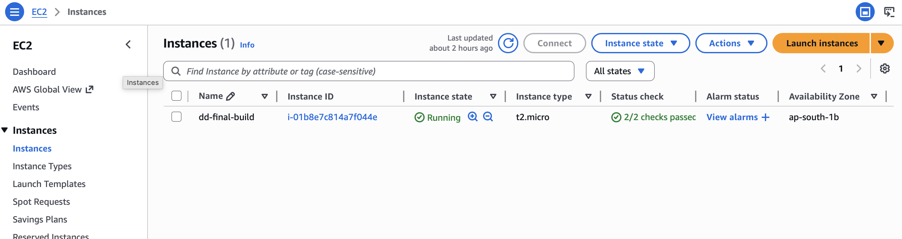
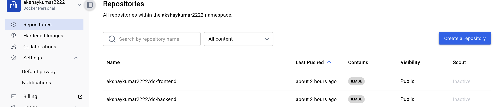
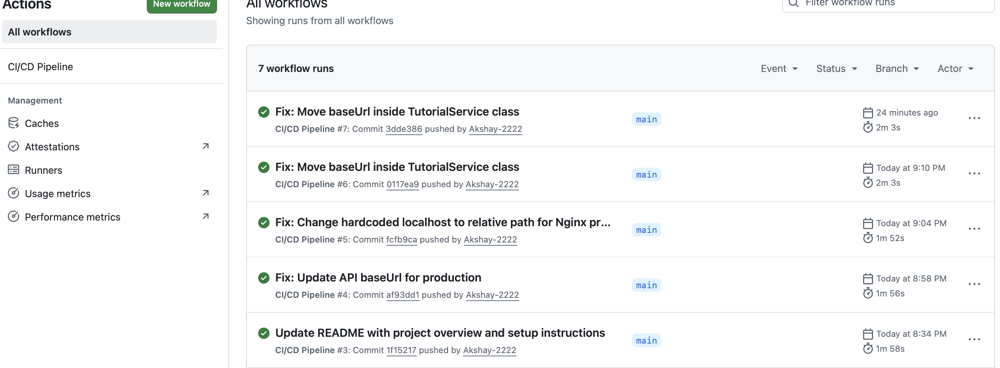
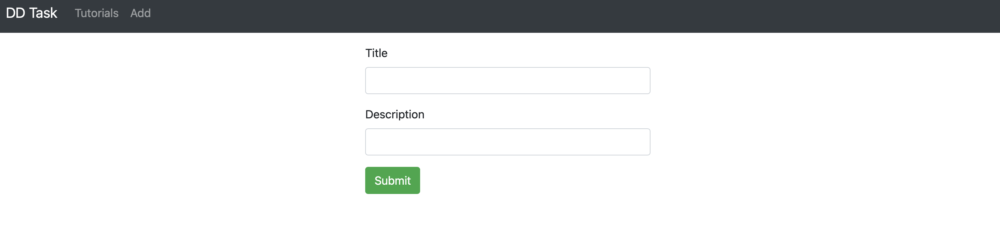

# AWS Cloud Deployment & Infrastructure Project

A production-grade MEAN stack application (Angular, Node.js, MongoDB) deployed on AWS EC2 with full CI/CD automation via GitHub Actions, Nginx reverse proxy, and Docker containerisation — including a documented real-world Out-Of-Memory crash diagnosis and resolution.

---

## What This Project Does

Takes a full-stack MEAN application and builds a complete, automated cloud deployment pipeline around it — from local development to a hardened, production-equivalent AWS EC2 environment. Every infrastructure decision is documented with the problem it solved and the reasoning behind it.

---

## Architecture

```
Developer pushes to main branch
        ↓
GitHub Actions Pipeline
  → Build Docker images (Angular + Node.js)
  → Push images to Docker Hub
  → SSH into EC2
  → Pull latest images
  → docker-compose up (restart containers)
        ↓
AWS EC2 (Ubuntu, t2.micro)
  Security Group: Port 80 (public), Port 22 (SSH only)
        ↓
Nginx Reverse Proxy (Port 80)
  → Routes traffic → Angular frontend container (Port 8081)
  → Routes /api → Node.js backend container (Port 8080)
        ↓
MongoDB container (internal Docker network only)
```

---

## Tech Stack

| Layer | Technology |
|---|---|
| Frontend | Angular (TypeScript) |
| Backend | Node.js + Express |
| Database | MongoDB (containerised) |
| Containerisation | Docker + Docker Compose |
| Web Server / Proxy | Nginx |
| Cloud Provider | AWS EC2 (Ubuntu, t2.micro) |
| CI/CD | GitHub Actions + Docker Hub |

---

## Evidence — Live Deployment Walkthrough

### Step 1 — EC2 Instance Running on AWS
The Ubuntu EC2 instance provisioned and running in the AWS Console with Security Groups configured.



---

### Step 2 — Docker Containers Running on EC2
All containers (Angular frontend, Node.js backend, MongoDB) confirmed running on the EC2 instance via Docker.



---

### Step 3 — GitHub Actions CI/CD Pipeline — Successful Run
Automated pipeline completed: Docker images built, pushed to Docker Hub, and deployed to EC2 via SSH — zero manual steps.



---

### Step 4 — Live Website Served via Nginx
The full MEAN stack application live and accessible in the browser — confirming Nginx reverse proxy is correctly routing public traffic to the Docker containers on the EC2 instance.



---

## Engineering Challenges & Solutions

### Challenge 1 — Out-Of-Memory Crash During Container Builds

**Problem:** The EC2 instance ran out of memory during Docker container builds, causing the build process to crash and the server to become unresponsive.

**Diagnosis:** Identified through server freeze during the Angular frontend build. EC2 instance was under heavy memory pressure from concurrent container build processes.

**Solution:** Increased the EC2 instance EBS storage volume size via the AWS Console — EC2 → Elastic Block Store → Volumes → Modify Volume. This gave the build process sufficient headroom to complete without crashing.

**Result:** Build completed successfully with no instance type upgrade and no recurring cost increase.

---

### Challenge 2 — Container Port Exposure

**Problem:** Docker containers run on internal ports (8080, 8081). Requiring users to append port numbers to URLs is not acceptable for a real deployment.

**Solution:** Installed Nginx as a reverse proxy at Port 80. Configured location blocks to route traffic transparently to each container — users access the app through a clean URL with no port number visible.

```nginx
server {
    listen 80;

    location /api/ {
        proxy_pass http://localhost:8080;
    }

    location / {
        proxy_pass http://localhost:8081;
    }
}
```

---

### Challenge 3 — Manual Deployments

**Problem:** Every code change required manually SSH-ing into the server, pulling new code, rebuilding images, and restarting containers — slow and error-prone.

**Solution:** GitHub Actions CI/CD pipeline. Every push to `main` automatically builds fresh Docker images, pushes them to Docker Hub, SSH-connects to EC2, and redeploys containers. No manual steps required.

---

## Security Configuration

**AWS Security Group rules:**

| Port | Protocol | Source | Purpose |
|---|---|---|---|
| 80 | TCP | 0.0.0.0/0 | Public web access via Nginx |
| 22 | TCP | Restricted | SSH management only |
| 8080, 8081 | — | Blocked | Containers not publicly exposed |

MongoDB runs on the internal Docker network only — not accessible from the internet.

---

## How to Run Locally

```bash
# 1. Clone the repository
git clone https://github.com/Akshay-2222/AWS-Cloud-Deployment-Infrastructure-Project.git
cd AWS-Cloud-Deployment-Infrastructure-Project

# 2. Build and start all containers
docker-compose up -d --build

# 3. Access the application
# Frontend:    http://localhost:8081
# Backend API: http://localhost:8080

# 4. Stop containers
docker-compose down
```

---

## CI/CD Pipeline Status

**Continuous Integration:** Active — Docker images are built and pushed to Docker Hub on every push to `main`.

**Continuous Deployment:** Fully configured. EC2 instance is currently stopped to avoid ongoing cloud costs. Deployment restores in under 5 minutes by starting the instance and adding EC2 host details to GitHub Secrets.

---

## Repository Structure

```
AWS-Cloud-Deployment-Infrastructure-Project/
├── frontend/               # Angular application
├── backend/                # Node.js + Express API
├── .github/workflows/      # GitHub Actions CI/CD pipeline
├── docker-compose.yml      # Multi-container orchestration
├── screenshots/            # Deployment evidence screenshots
└── README.md
```

---

## Skills Demonstrated

- AWS EC2 provisioning, EBS storage management, and Security Group configuration
- Docker and Docker Compose multi-container orchestration
- Nginx reverse proxy configuration for containerised workloads
- OOM crash diagnosis and resolution via AWS infrastructure adjustment
- GitHub Actions CI/CD pipeline with Docker Hub integration
- SSH-based remote server management and deployment automation

---

## Author

**Akshay Kumar Surabathula**
Cloud Infrastructure Engineer | AWS Certified Cloud Practitioner
[GitHub](https://github.com/Akshay-2222) · [LinkedIn](https://linkedin.com/in/akshay-kumar-surabathula)
